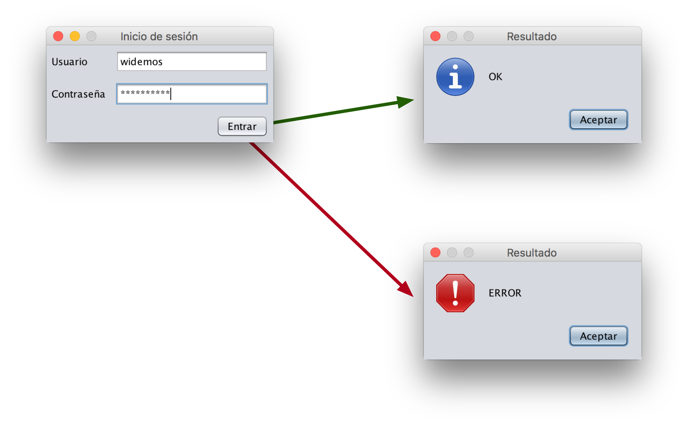

# Ejercicio 1 - Login

Queremos crear una ventana de *login* para una aplicación que estamos construyendo.

En la imagen podemos ver cómo tiene que ser y funcionar:

Para poder comprobar su funcionamiento, los datos de usuario y contraseña serán siempre los mismos.
