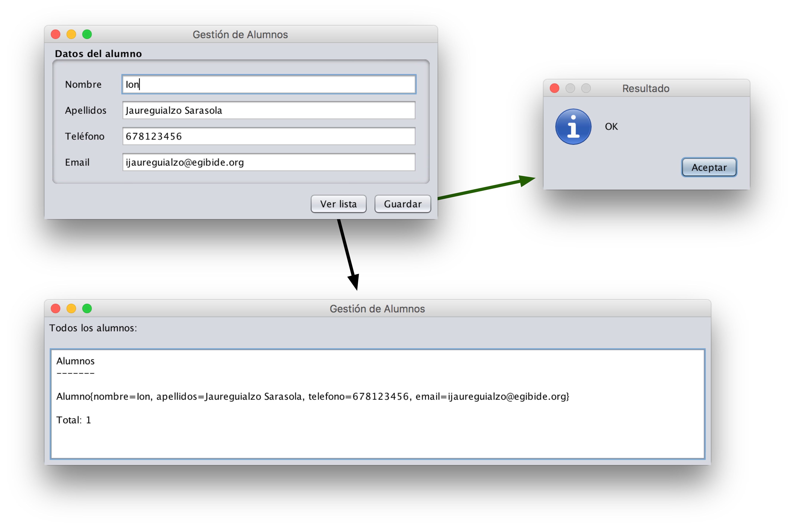

# Ejercicio 2 - Alumnos GUI

Nuestro cliente nos ha proporcionado este *mockup* de una aplicación que quiere que le programemos:

Se nos pide:

- Construir el interfaz de usuario usando Swing.
- Almacenar los datos en una estructura `List<E>`.
- Mostrar los datos almacenados en la estructura usando un área de texto.
